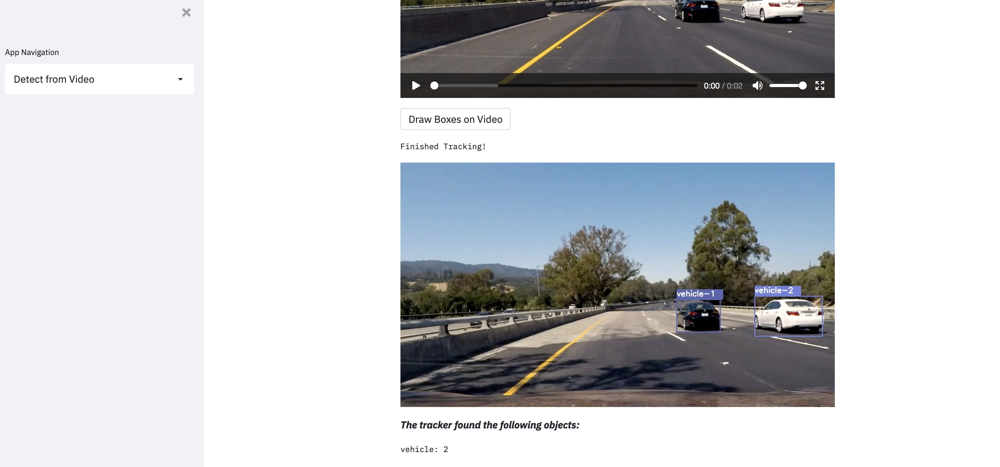
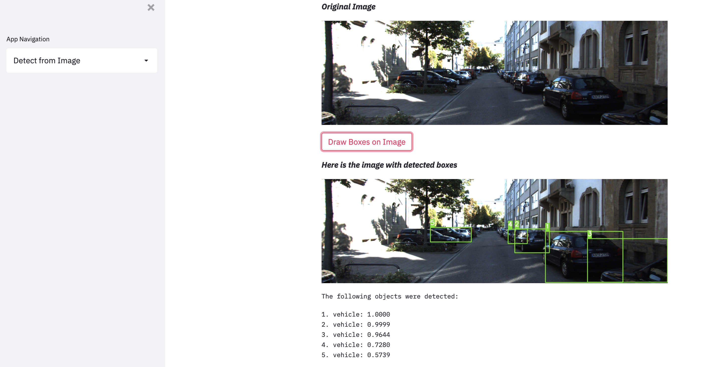

# Street Traffic Predictor
Detects vehicles and pedestrians on images and videos

Using this webapp, a user can upload a photo or video and detect vehicles in them. Bounding boxes are drawn around the detected objects.

For videos, these objects are tracked frame by frame. The total number of each type of object is printed.



For images, boxes are simply drawn over each object. Each detected object and their confidence is printed.



## How to Run

### Downloading Requirements

After downloading this project, first run the following to download all the needed packages

```pip install requirements.txt```

### Extra Files

You will then need to download the weights file. You can put in any weights file in ```pages/data```, but the file name should be ```yolov3-kitti_best.weights```. If you want to upload your own YOLO config file, put it in ```pages/single-image/```, then in ```image_detection.py```, change the parameter used to define net in the ```get_boxes()``` method accordingly.

You will also need to save the YOLO model beforehand. This can be done with the save_model function. Run the following command:

```python save_model.py --weights ./pages/data/yolov3-kitti_best.weights --output ./pages/checkpoints/yolov3-kitti --model yolov3```

If run successfully, the folder ```pages/checkpoints/yolov3-kitti/``` should contain a directory called ```variables```, with both an index file and a file called ```variables.data-00000-of-00001```

### Running the App

Finally, you can run the app with the following command:

```streamlit run app.py```

## Relevant Sources

DeepSort Implementation (Used to Track Objects On Video): https://github.com/nnair12/yolov4-deepsort
